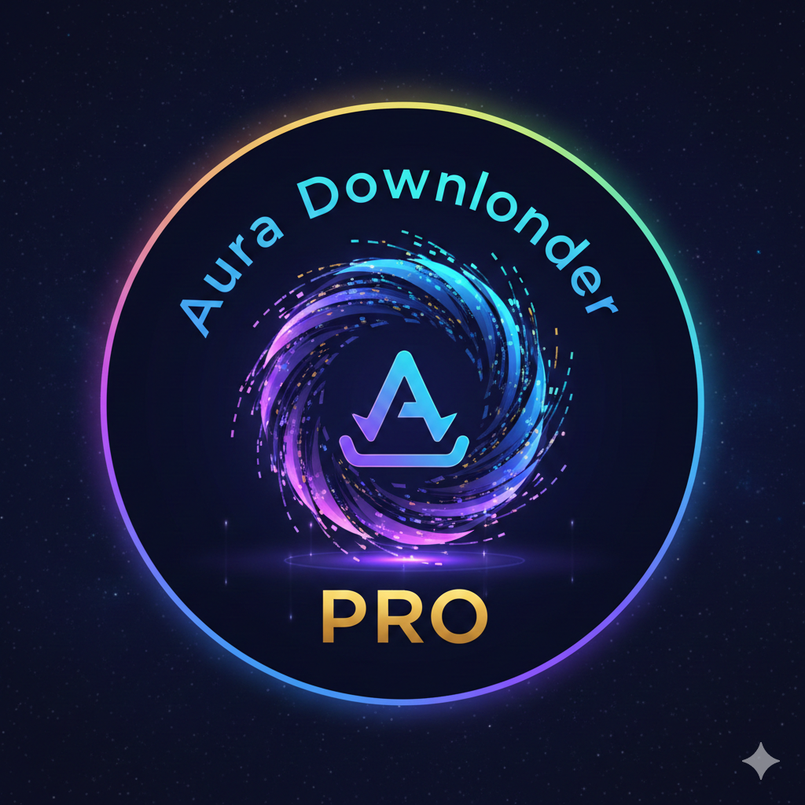

# Aura Downloader Pro v1.0.2

A powerful, modern desktop download manager built with Python and CustomTkinter.  
Download videos, audio, software, images, and any file — from YouTube and any URL.



## Features

- **Universal Downloads** — YouTube videos/audio, software (.exe, .zip), movies, images, and any direct file URL
- **Accelerated Downloads** — Files are split into 8 parallel chunks and stitched back together for maximum speed
- **Multi-File Queue** — Download up to 3 files simultaneously with individual progress tracking
- **Pause / Resume / Cancel** — Full control over every download in the queue
- **Clipboard Link Catcher** — Automatically detects copied URLs and saves them in a side panel notepad
- **Quality Selector** — Choose from all available video/audio qualities for YouTube and supported sites
- **Smart URL Detection** — Automatically identifies YouTube links, direct files, and generic URLs
- **Playlist Stripping** — YouTube playlist parameters are automatically removed to focus on the single video
- **Windows Notifications** — Toast notifications for download start/complete events
- **Custom Logo & Icon** — Branded with the Aura Downloader Pro logo

## Requirements

- Python 3.8+
- Windows 10/11 (for notifications)
- FFmpeg (optional, required for MP3 conversion)

## Installation

```bash
pip install -r requirements.txt
python main.py
```

## Dependencies

- `yt-dlp` — Video/audio extraction from 1000+ sites
- `customtkinter` — Modern themed GUI toolkit
- `requests` — HTTP downloads with Range header support
- `Pillow` — Image processing for logo/icon

## Build Standalone EXE

```bash
pip install pyinstaller
pyinstaller --onefile --windowed --icon=aura_icon.ico --add-data "aura-downloder-pro.png;." --name "AuraDownloaderPro" main.py
```

## Version History

| Version | Changes |
|---------|---------|
| 1.0.2   | Pause/Resume/Cancel, solid dark UI, playlist stripping, chunked downloads |
| 1.0.1   | Multi-file queue, clipboard notepad, universal downloads, logo |
| 1.0.0   | Initial YouTube downloader with quality selection |

## License

MIT License — see [LICENSE](LICENSE) for details.
